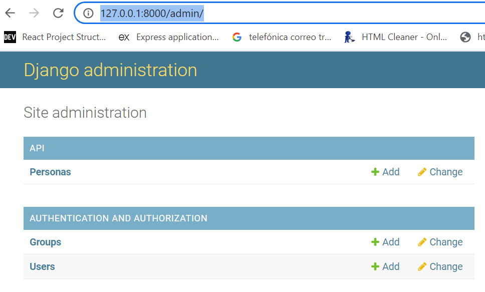

# Api rest django

Una vez creado el proyecto: [Como crear proyecto django](https://github.com/orijmm/codigostest/blob/main/django/CreateProject.md) 

Ver la version de django

``py -m django --version``

#### ***1. Instalar la libreria django rest framework***

``pip install djangorestframework``

#### ***2. Crear aplicación llamada "api" (o como quieras) :***

``django-admin startapp api``

#### ***3. Registrar aplicacion y libreria Rest Framework en nombreproyecto/settings.py agregar al final de INSTALLED_APPS***

    INSTALLED_APPS = [
        'django.contrib.admin',
        ... otras apps...
        'rest_framework',
        'api',
    ]

#### ***4.  Crear superuser***

``py manage.py createsuperuser --email admin@example.com --username admin``

Te pedira ingresar password dos veces

#### ***5. Crear un modelo en la aplicación "api", en nombreproyecto/api/models.py***

    from django.db import models

    class Persona(models.Model):
        id = models.AutoField(primary_key = True)
        nombre = models.CharField('Nombre', max_length = 100)
        apellido = models.CharField('Apellido', max_length = 200)

        def __str__(self):
            return '{0},{1}'.format(self.apellido,self.nombre)

#### ***6. Crear migracion para Persona y volver a correr las migraciones***

``py manage.py makemigrations``

``py manage.py migrate``

#### ***7. Registrar modelo "Personas" en la app "api", en nombreproyecto/api/admin.py***

    from django.contrib import admin
    from .models import Persona

    admin.site.register(Persona)

#### ***8. Levantar el servidor***

``py manage.py runserver``

Con eso ya deberia aparecer en el dashboard de rest framework http://127.0.0.1:8000/admin/, loguear con el admin creado

Se deberia mostrar modelos de usuarios, grupos por defecto, más el modelo Persona creado

